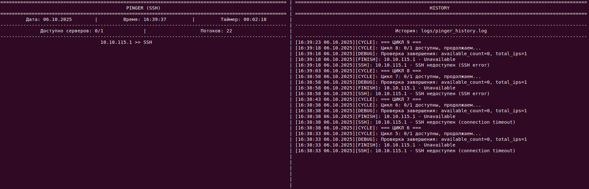
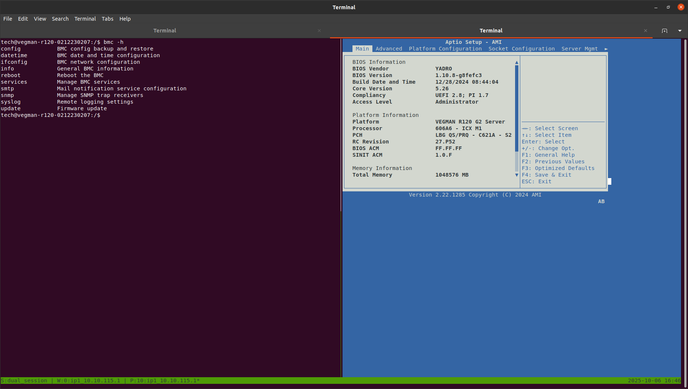
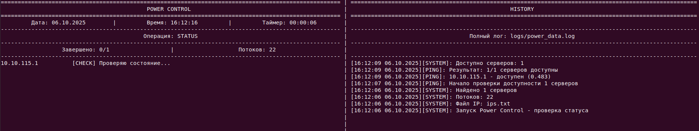
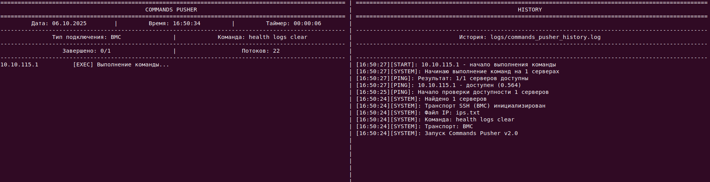
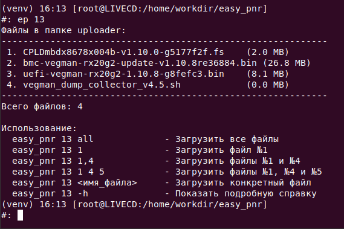
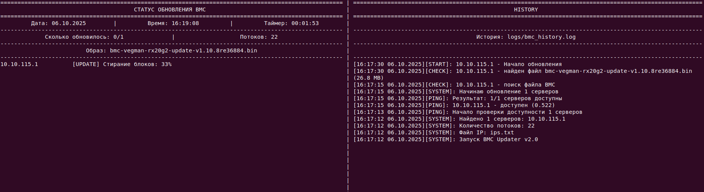
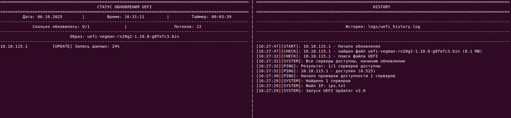
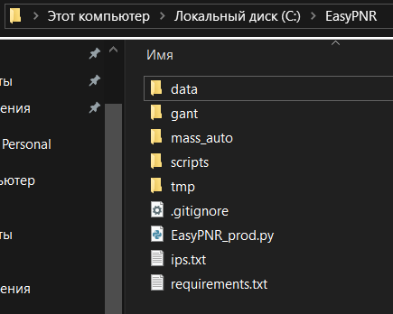

<h1 id="easy">EASY (Engineering Automation Shell YADRO)</h1>

```
-    -    -    -    -    -    -     -    -    -    -    -    -    -
      _______ _______ _______ __   __  _____  __   _  ______     
-     |______ |_____| |______   \_/   |_____| | \  | |_____/      -
-     |______ |     | ______|    |    |       |  \_| |    \_      -
                                                               
-    -    -    -    -    -    -     -    -    -    -    -    -    -
```

EASY - это инструмент, предназначенный для автоматизации проведения массовых пуско-наладочных работ. EASY включает в себя большое количество скриптов, упрощающих процесс настройки серверов VEGMAN.

Авторство: YADRO Team x86

```Copyright © 20XX ООО "КНС ГРУПП".  All rights reserved.```


<h2 id="project-structure">📁 СТРУКТУРА ПРОЕКТА</h2>

<h3 id="project-tree">Дерево</h3>

```
📁 easy_pnr/
├── 📁 data/  .....................  файлы для работы с серверами
│   ├── 📁 downloader/  ...............  выгруженные с серверов файлы
│   ├── 📁 for_easy_log/  .............  скрипты для работы с логами
│   └── 📁 uploader/  .................  файлы на загрузку на сервера
├── 📁 docs/  .....................  документация
├── 📁 gant/  .....................  планирование и отчеты
├── 📁 logs/  .....................  все логи тут
│   ├── 📁 catcher/  ..................  ?? логи кетчера ??
│   └── 📁 easy_log/  .................  логи bmc и sds (отдельно) в формате .log
│       └── 📁 merged_logs/ ...........  логи bmc и sds (вместе) в формате .log
├── 📁 mass_auto/  ................  для подготовленных скриптов
├── 📁 output/  ...................  скленные логи в формате .xlsx
├── 📁 scripts/  ..................  все скрипты
├── 📁 tmp/  ......................  временные файлы
├── 📁 venv/  .....................  виртуальное окружение
├── 🔑 credential.py  .............  логины и пароли от серверов
├── 🚀 EasyPNR_prod.py  ...........  главный скрипт
├── 📄 ips.txt  ...................  адреса серверов
└── 📜 requirements.txt  ..........  зависимости проекта
```

<h2 id="configuration">🔧 КОНФИГУРАЦИЯ</h2>

<h3 id="minimal-prereqs">Минимальные требования</h3>

- Yadro LiveCD версии не ниже x.x.x

<h3 id="ips.txt-configuration">Настройка файла ips.txt</h3>

Файл располагается в корневой папке EASY (см. [структуру проекта](#project-structure)).  
В него по одному на строчку вносятся IP-адреса машин, с которыми будет проводиться работа.  
Например, если на ПНР требуется настроить 4 сервера и они получили по DHCP адреса 10.10.77.1 - 10.10.77.4, то ips.txt будет выглядеть следующим образом:
```txt
10.10.77.1
10.10.77.2
10.10.77.3
10.10.77.4
```
<h3 id="credentials.py-configuration">Настройка файла credentials.py</h3>

Все логины и пароли хранятся тут.  
Файл создается в корневой директории проекта (см. [структуру проекта](#project-structure))  
В целях безопасности, этот файл не может находиться в исходных файлах EASY, поэтому инженеру нужно самостоятельно создать его и носить на флешке.

<h2 id="start">⚡️ БЫСТРЫЙ СТАРТ</h2>

Утилита доступна в Yadro LiveCD по команде `ep`.

Для быстрого старта работ рекомендуется заглянуть в заметки техника в каталоге `docs/` корневой папки проекта. Там перечислены некоторые готовые последовательности команд, направленные на решение определенных задач, а также всевозможные подсказки, нюансы, шорткаты.  

Также в инструменте есть уже готовые скрипты, выполняющие те или иные задачи. Чтобы увидеть их все, воспользуйтесь командой:
```sh
ep -a
```

<h1 id="commands">⚙️ ОСНОВНЫЕ КОМАНДЫ</h1>

Все команды начинаются с краткого `ep`

> [!TIP]  
> К любой команде можно добавить флаг `-h` для получения справочной информации по команде.

<h2 id="commands-monitor">🖥️ Мониторинг</h2>

### ep pinger == ep 1

Запускает меню для проверки доступности адресов из [ips.txt](#ips.txt-configuration).  
Доступные аргументы:  
```sh
--cycle    # запукает пинг в цикле, пока все сервера не будут доступны
```

Пример использования с выводом программы:  
```sh
ep pinger
ep 1              # запуск пинга
ep 1 2            # запуск проверки доступности SSH
ep 1 2 --cycle    # запуск цикличной проверки SSH
```

<details>
<summary>ep 1</summary>


</details>

<details>
<summary>ep 1 2 --cycle</summary>



</details>


---

### ep monitor == ep 6

Создает tmux окна с SOL консолями для всех серверов.  
Автоматически создает дополнительные окна при большом количестве серверов.  
Управление окнами, переключение между ними и прочие действия выполняются при помощи [горячих клавиш](#tmux-control).

Пример использования:
```sh
ep 6 1
```

---

### ep dual_session == ep 7

Создаёт для каждого сервера отдельное окно tmux с двумя панелями:
- Левая панель: SSH к BMC (порт 22)
- Правая панель: SOL (порт 2200)  

[Горячие клавиши для управления tmux](#tmux-control).

Пример использования:
```sh
ep dual_session 1
ep 7 1
```
<details>
<summary>Вывод</summary>

```sh
[+] Найдено IP: 1
[+] Быстрый запуск: 1 IP с режимом 'horizontal'
[+] Выбранные IP: 188.32.210.218

=== Dual Session ===
Горячие клавиши:
  Alt+n/p - переключение окон
  Alt+←/→/↑/↓ - переключение панелей
  Alt+0 - завершить сервер


 *** Для выхода из сессии используйте Alt+0 или в SSH напишите exit, потом kill-server ***
```



</details>

---

### ep info_collector == ep 20

Собирает следующую информацию о каждом сервере:  
- IP
- Серийный номер
- BMC версию
- BIOS версию
- FPGA версию

Пример использования:
```sh
ep 20
```

<details>
<summary>Вывод</summary>

.png)

</details>

---

<h2 id="commands-management">🕹️ Управление</h2>

### ep power_control == ep 8

Включает/выключает хост.  
Принимает аргумент:
```sh
"on"     # включить
"off"    # выключить
"st"     # статус
"br"     # перезагрузка BMC
```

Пример использования:
```sh
ep power_control on
ep 8 br
```

<details>
<summary>Вывод `ep 8 st`</summary>



.png)

</details>

---

### ep boot_switcher == ep 9

Изменяет, куда загружается хост

Пример использования:
```sh
ep boot_switcher uefishell
```

---

### ep catcher == ep 10

"Ловит" состояние сервера для грамотного исполнения скриптов, чтобы отправлять команды в нужный момент времени.

Способен зафиксировать, когда сервер вошел в:
- UEFI Shell
- YADRO UEFI BIOS
- SDS
- LiveCD

---

### ep commands_pusher == ep 11

Отправляет команды в консоль. Первый аргумент - пункт назначения команды (SOL, BMC, SDS), второй - сама команда.

Формат пункта назначения:
```sh
"1" или "sol"    # SOL
"2" или "bmc"    # BMC
"3" или "sds"    # SDS
```

Пример использования:
```sh
ep command_pusher 1 "cd EFI\BOOT"
ep 11 2 "health logs clear"
```

<details>
<summary>Вывод</summary>



</details>

---

### ep special_characters == ep 12

Отправляет в консоль SOL специальные знаки.

Список знаков: см. [приложение](#special-characters).

Пример:
```sh
ep special_characters enter
ep 12 delete
```

---

<h2 id="commands-update">🔄 Обновления</h2>

### ep uploader == ep 13

Загружает файлы из папки `data/uploader/` на сервер в `/tmp/` (см. [структуру проекта](#project-structure)).  
При запуске программы без указания аргументов/флагов, она выводит нумерованный список всех файлов в папке `data/uploader/`.  
В качестве аргумента программа принимает номер файла или его название (можно несколько через пробел).

Пример использования:
```sh
ep uploader
ep 13 all      # загрузить всё
ep 13 1        # загрузить первый файл
ep 13 2 4 5    # загрузить файлы 2, 4 и 5
```
<details>
<summary>Вывод</summary>



.png)

</details>

---

### ep downloader == ep 14

Скачивает файлы из папки `/tmp/` в `data/downloader/`

Пример использования:
```sh
ep downloader
```

---

### ep bmc_update == ep 15

Обновляет BMC.  
Самостоятельно находит прошивку BMC и использует ее.

Пример использования:
```sh
ep 15
```

<details>
<summary>Вывод</summary>



</details>

---

### ep uefi_update == ep 16

Обновляет BIOS.  
Самостоятельно находит прошивку BIOS и использует ее.

Пример использования:
```sh
ep 16
```

<details>
<summary>Вывод</summary>



</details>

---

### ep nvram_update == ep 17

Переписывает настройки BIOS.

Пример использования:
```sh
ep 17
```

---

### ep fpga_update == ep 18

Обновляет FPGA.

Пример использования:
```sh
ep 18
```

---

### ep bios_backup == ep 19

Пример использования:
```sh
ep 19
```

---

<h2 id="commands-logs">🧾 Логи</h2>

### ep bmc_log == ep 3

Собирает логи BMC с каждого сервера и сохраняет их в папку [logs/easy_log/](#project-structure).

---

### ep sds_log == ep 4

Собирает логи SDS с каждого сервера и сохраняет их в папку [logs/easy_log/](#project-structure).

---

### ep parser == ep 5

Объединяет собранные BMC и SDS логи и сохраняет их в папку [logs/easy_log/merged_logs/](#project-structure).

Пример использования:
```sh
ep 5
```

---

### ep logs_saver == ep 22

Сохраняет логи на флешку в специально отведенный раздел.

Пример использования:
```sh
ep 22
```

---

<h2 id="commands-special">🛠️ Служебные</h2>

### ep rm_known_hosts == ep 666

Очищает сохраненные записи о хостах.  
Важнейший инструмент для исправления проблем.  
Что-то не работает? Пропишите `rm_known_hosts`:

```sh
ep 666
```

---

### ep sol_sds_ip_changer == ep 2

Выставляет на eno4 интерфейсах серверов адреса, стоящие на eth0.  
Это нужно, чтобы, переключаясь на eno4 для снятия логов с SDS, не терять связь с сервером.

Пример использования:
```sh
ep 2
```

---

### ep dhcp == ep 23

Запускает DHCP сервер.  
Все подключенные устройства автоматически записываюся в [ips.txt](#настройка-файла-ipstxt).  
При вызове программы без аргументов/флагов выводит список интерфейсов на устройстве.

Флаги и аргументы:
```sh
# --==  Обязательные  ==--
-i, --iface     # указать сетевой интерфейс
-c, --count     # указать количество раздаваемых адресов (1 - 254)
# --==  ============  ==--

# --== Дополнительные ==--
-d, --range     # диапазон IP адресов (по умолчанию 1 - {count})
--full-clear    # полная очистка: DHCP записи + ARP + перезапуск dnsmasq
--quiet         # тихий режим - только важная информация
# --== ============== ==--
```

Пример использования:
```sh
ep 23                           # Тут можно узнать свой интерфейс
ep 23 -i eth0 -c 15
ep 23 -i eth0 -c 15 -d 11-25
```

> [!IMPORTANT]  
> Вставляйте кабель eth в ноутбук только после запуска DHCP.  
> Иначе он не найдет сервера.

---

### ep set_static_ip == ep 24

Выставляет на eth0 серверов статические IP.  
Полезно для длительных работ.

Пример использования:
```sh
ep 24
```


<h1 id="application">🧷 Приложения</h1>

<h3 id="special-characters">1) Спец символы</h3>

<details>
<summary>Список</summary>

```sh
# Базовые управляющие символы
'------------------------------------------------------------------'
"ctrl_c":        "\x03",        # Ctrl+C - прерывание
"ctrl_d":        "\x04",        # Ctrl+D - EOF
"ctrl_z":        "\x1a",        # Ctrl+Z - приостановка
"ctrl_l":        "\x0c",        # Ctrl+L - очистка экрана
"ctrl_u":        "\x15",        # Ctrl+U - очистка строки
"ctrl_k":        "\x0b",        # Ctrl+K - удаление до конца строки
"ctrl_a":        "\x01",        # Ctrl+A - начало строки
"ctrl_e":        "\x05",        # Ctrl+E - конец строки
"ctrl_w":        "\x17",        # Ctrl+W - удаление слова назад
'------------------------------------------------------------------'

# Навигация
'------------------------------------------------------------------'
"enter":         "\r",          # Enter
"tab":           "\t",          # Tab
"backspace":     "\x08",        # Backspace
"space":         " ",           # Пробел
'------------------------------------------------------------------'

# Стрелки (ANSI escape sequences)
'------------------------------------------------------------------'
"up":            "\x1b[A",      # Стрелка вверх
"down":          "\x1b[B",      # Стрелка вниз
"left":          "\x1b[D",      # Стрелка влево
"right":         "\x1b[C",      # Стрелка вправо
'------------------------------------------------------------------'

# Функциональные клавиши (F1-F12)
'------------------------------------------------------------------'
"f1":            "\x1bOP",      # F1
"f2":            "\x1bOQ",      # F2
"f3":            "\x1bOR",      # F3
"f4":            "\x1bOS",      # F4
"f5":            "\x1b[15~",    # F5
"f6":            "\x1b[17~",    # F6
"f7":            "\x1b[18~",    # F7
"f8":            "\x1b[19~",    # F8
"f9":            "\x1b[20~",    # F9
"f10":           "\x1b[21~",    # F10
"f11":           "\x1b[23~",    # F11
"f12":           "\x1b[24~",    # F12
'------------------------------------------------------------------'
    
# Дополнительные клавиши
'------------------------------------------------------------------'
"home":          "\x1b[H",      # Home
"end":           "\x1b[F",      # End
"page_up":       "\x1b[5~",     # Page Up
"page_down":     "\x1b[6~",     # Page Down
"pgup":          "\x1b[5~",     # Page Up (synonym)
"pgdn":          "\x1b[6~",     # Page Down (synonym)
"insert":        "\x1b[2~",     # Insert
"delete":        "\x1b[3~",     # Delete
"del":           "\x1b[3~",     # DEL (альтернативное название)
'------------------------------------------------------------------'

# Escape последовательности
'------------------------------------------------------------------'
"escape":        "\x1b",        # Escape
"clear":         "\x1b[2J",     # Очистка экрана
"clear_line":    "\x1b[K",      # Очистка строки
'------------------------------------------------------------------'
```

</details>

<h3 id="tmux-control">2) Управление tmux</h3>

<details>
<summary>Горячие клавиши</summary>

```sh
'---------------------------------------------------------------------------------'
' Alt  +  ←/→/↑/↓  '    # Переключение между панелями в текущем окне
' Alt  +  n/p      '    # Следующее/предыдущее окно
' Alt  +  1-9      '    # Быстрое переключение на окно 1-9
' Alt  +  0        '    # Закрыть текущую панель
' Alt  +  k        '    # Закрыть всю сессию (выход)
' Alt  +  %        '    # Разделить панель по вертикали
' Alt  +  "        '    # Разделить панель по горизонтали
' Alt  +  Space    '    # Следующая раскладка
' Alt  +  s        '    # Переключить broadcast/unicast режим (одновременный ввод)
' Alt  +  i/I      '    # Выключить/включить отображение IP в заголовках
' Ctrl +  a        '    # Префикс tmux
'---------------------------------------------------------------------------------'
```

</details>

<h3 id="aliases">3) Общий список команд</h3>

<details>
<summary>Список</summary>

```sh
'--------------------------------'
"1":      # pinger
"2":      # sol_sds_ip_changer
"3":      # bmc_log
"4":      # sds_log
"5":      # parser
"6":      # monitor
"7":      # dual_session
"8":      # power_control
"9":      # redfish_boot_switcher
"10":     # catcher
"11":     # commands_pusher
"12":     # special_characters
"13":     # uploader
"14":     # downloader
"15":     # bmc_update_script
"16":     # uefi_update_script
"17":     # nvram_dump_write
"18":     # fpga_updater
"19":     # bios_backup
"20":     # info_collector
"21":     # uefi_boot_default
"22":     # logs_saver
"23":     # dhcp_master
"24":     # set_static_ip
"101":    # easy_log
"666":    # rm_known_hosts
'--------------------------------'
```

</details>

<h3 id="wsl">n) Настройка EASY на WSL</h3>

$\color{#FF6961}\large{\textbf{В разработке...}}$

<details>
<summary>Минимальные требования</summary>

- Linux Ubuntu 24.04 (можно использовать и другие версии, но они не тестировались)
- Python 3.10 (в WSL уже есть)

</details>

<details>
<summary>Установка EASY в WSL</summary>

Скопируйте проект в `C:\EasyPNR\ep\` вручную или командами (WSL):
```sh
mkdir -p /mnt/c/EasyPNR/ep/
cd /mnt/c/EasyPNR/ep/
git clone https://github.com/Stanly1-1/Engineering-Automation-Shell-YADRO.git
```

<details>
<summary>Результат</summary>



</details>

Создайте виртуальное окружение (немного терпения, команда выполняется, ничего не зависло):
```sh
python3 -m venv venv
```

Активируйте его:
```sh
source venv/bin/activate
```
Должна появиться приписка "(venv)":  


</details>

<details>
<summary>Установка зависимостей</summary>

Установите системные пакеты:
```sh
sudo apt install -y python3 python3-pip python3-venv sshpass iputils-ping net-tools tmux
```

Обновите pip:
```sh
pip install --upgrade pip
```

> [!IMPORTANT]  
> Проверьте, что вы в виртуальном окружении!  
> В начале командной строки должна быть надпись "(venv)"!

Установите зависимости:
```sh
pip install -r requirements.txt
```

</details>

<details>
<summary>Начало работы</summary>

Для начала работы с инструментом нужно создать в системе алиас (сокращение):
```sh
echo "alias ep='cd /mnt/c/EasyPNR/ep/ && source venv/bin/activate && python3 /mnt/c/EasyPNR/ep/EasyPNR_prod.py'" >> ~/.bashrc && source ~/.bashrc
```
Теперь инструмент доступен по команде `ep`

> [!TIP]  
> Вместо `ep` можно написать любой удобный вам алиас.

</details>
