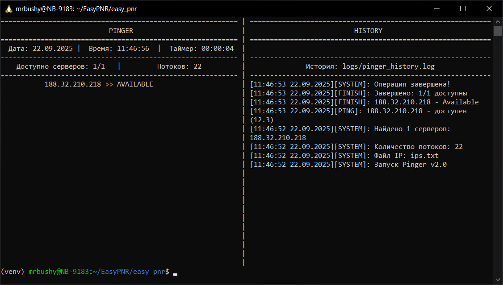

EASY (Engineering Automation Shell YADRO)
=========================================

```
-    -    -    -    -    -    -     -    -    -    -    -    -    -
      _______ _______ _______ __   __  _____  __   _  ______     
-     |______ |_____| |______   \_/   |_____| | \  | |_____/      -
-     |______ |     | ______|    |    |       |  \_| |    \_      -
                                                               
-    -    -    -    -    -    -     -    -    -    -    -    -    -
```

EASY - это инструмент, предназначенный для автоматизации проведения массовых пуско-наладочных работ. EASY включает в себя большое количество скриптов, упрощающих процесс настройки серверов VEGMAN.

Авторство: YADRO Team x86

```Copyright © 20XX ООО "КНС ГРУПП".  All rights reserved.```

БЫСТРЫЙ СТАРТ
-------------
### Минимальные требования
- Linux Ubuntu 24.04 (можно использовать и другие версии, но они не тестировались)
- Python 3.10

### Установка зависимостей
Для установки всех зависимостей, используйте команду в терминале:
```sh
pip3 install -r requirements.txt
```

### Начало работы
Для начала работы с инструментом нужно создать в системе алиас (сокращение):
```
echo alias ep='cd /home/mrbushy/EasyPNR/easy_pnr/ && source venv/bin/activate && python3 /home/mrbushy/EasyPNR/easy_pnr/EasyPNR_prod.py' >> ~/.bashrc && source ~/.bashrc
```
Теперь вместо длинной команды в одиночных кавычках достаточно писать просто `ep`

> [!TIP]
> Вместо `ep` можно написать любой удобный вам алиас.

КОНФИГУРАЦИЯ
------------
### Настройка файла ips.txt
Файл располагается в корневой папке EASY. В него по одному на строчку вносятся IP-адреса машин, с которыми будет проводиться работа.

Например, если на ПНР требуется настроить 4 сервера и они получили по DHCP адреса 10.10.77.1 - 10.10.77.4, то ips.txt будет выглядеть следующим образом:
```txt
10.10.77.1
10.10.77.2
10.10.77.3
10.10.77.4
```
### Настройка файла credentials.py
Все логины, пароли тут.

СТРУКТУРА ПРОЕКТА
-----------------
### Дерево
```
📁 easy_pnr/
├── 📁 __pycache__/  ..............  кеш пайтона
├── 📁 data/  .....................  файлы 
│   ├── 📁 downloader/  ...............  выгруженные с серверов файлы
│   ├── 📁 for_easy_log/  .............  скрипты для работы с логами
│   └── 📁 uploader/  .................  файлы на загрузку на сервера
├── 📁 docs/  .....................  документация
├── 📁 gant/  .....................  планирование и отчеты
├── 📁 logs/  .....................  все логи тут
│   ├── 📁 catcher/  ..................  ?? логи кетчера ??
│   └── 📁 easy_log/  .................  логи bmc и sds (отдельно) в формате .log
│       └── 📁 merged_logs/ ...........  логи bmc и sds (вместе) в формате .log
├── 📁 mass_auto/  ................  для подготовленных скриптов
├── 📁 output/  ...................  скленные логи в формате .xlsx
├── 📁 scripts/  ..................  все скрипты
├── 📁 tmp/  ......................  временные файлы
└── 📁 venv/  .....................  виртуальное окружение
    ├── 📁 bin/  ......................  бинарники виртуального окружения
    ├── 📁 include/
    │   └── 📁 python3.12/
    ├── 📁 lib/
    │   └── 📁 python3.12/
    │       └── 📁 site-packages/  ....  библиотеки пайтона 3.12
    └── 📁 lib64/
```

ОСНОВНЫЕ КОМАНДЫ
----------------
### Мониторинг
#### `pinger`
Запускает меню для проверки доступности адресов из [ips.txt](#настройка-файла-ipstxt), команда не требует аргументов.  
Пример использования с выводом программы:
```sh
user@your_machene:~$ ep pinger
```


#### `monitor`
Создает tmux окна с панелями для всех IP адресов из ips.txt
Каждая панель содержит ssh-подключение к соответствующему серверу.
Автоматически создает дополнительные окна при большом количестве серверов.

#### `dual_session`
Создаёт для каждого IP из ips.txt отдельное окно tmux с двумя панелями:  
- Левая панель: SSH к BMC (порт 22)
- Правая панель: SOL (порт 2200)  

Горячие клавиши:
- Alt + n/p - переключение между окнами (следующее/предыдущее)
- Alt + ←/→/↑/↓ - переключение между панелями
- Alt + 0 - завершить tmux сервер (kill-server)

Пример использования с выводом программы:
```sh
ep dual_session 1
```
```
✅ Загружены учетные данные: SSH=tech, BMC=admin

[+] Найдено IP: 1
[+] Быстрый запуск: 1 IP с режимом 'horizontal'
[+] Выбранные IP: 188.32.210.218

=== Dual Session ===
Горячие клавиши:
  Alt+n/p - переключение окон
  Alt+←/→/↑/↓ - переключение панелей
  Alt+0 - завершить сервер


 *** Для выхода из сессии используйте Alt+0 или в SSH напишите exit, потом kill-server ***
```
[скрин]

### Логи

### Управление
#### `power_switcher`
Включает/выключает хост, принимает аргумент `on/off`

Пример использования с выводом программы:
```sh
ep power_switcher on
```

#### `redfish_boot_switcher`
Изменяет, куда загружается хост

Пример использования с выводом программы:
```sh
ep boot_switcher uefishell
```

### Обновления
#### `bmc_update`
Обновляет BMC 

#### `uefi_update`
Обновляет BIOS

#### `fpga_updater`
Обновляет FPGA

### Файлы
#### `uploader`
Загружает файлы на сервер

Пример использования с выводом программы:
```sh
ep uploader
```
```
Файлы в папке uploader:
------------------------------------------------------------
 1. vegman_dump_collector_v4.6.1.sh          (0.0 MB)
 2. CPLDmbdx8678x004b-v1.10.0-g5177f2f.fs    (2.0 MB)
 3. bmc-vegman-rx20g2-update-v2.2.1-g695910.bin.md5 (0.0 MB)
 4. uefi-vegman-rx20g2-2.2.1-gec1bc1.bin     (7.3 MB)
 5. uefi-vegman-rx20g2-2.2.1-gec1bc1.bin.md5 (0.0 MB)
 6. uefi-vegman-rx20g2-1.10.8-g8fefc3.bin    (8.1 MB)
 7. nvram-VEGMAN.R120-v1.10.4-g74bff8.02062501F5.bin (0.1 MB)
 8. bmc-vegman-rx20g2-update-v1.10.8re36884.bin (26.8 MB)
 9. bmc-vegman-rx20g2-update-v2.2.1-g695910.bin (27.6 MB)
10. openbmc-upgrade-guide-2-2-1.pdf          (0.2 MB)
------------------------------------------------------------
Всего файлов: 10

Использование:
  easy_pnr 13 all             - Загрузить все файлы
  easy_pnr 13 1               - Загрузить файл №1
  easy_pnr 13 1,4             - Загрузить файлы №1 и №4
  easy_pnr 13 1 4 5           - Загрузить файлы №1, №4 и №5
  easy_pnr 13 <имя_файла>     - Загрузить конкретный файл
  easy_pnr 13 -h              - Показать подробную справку
```

#### `downloader`
Скачивает файлы из папки /tmp/ всех серверов из [ips.txt](#настройка-файла-ipstxt) 

Пример использования с выводом программы:
```sh
ep downloader
```

### Служебные
#### `catcher`
"Ловит" состояние сервера для грамотного исполнения скриптов, чтобы отправлять команды в нужный момент времени.

Способен зафиксировать, когда сервер вошел в:
- UEFI Shell
- YADRO UEFI BIOS
- SDS
- LiveCD

#### `commands_pusher`
Отправляет команды в консоль. Первый аргумент - пункт назначения команды (SOL, BMC, SDS), второй - сама команда.

Формат пункта назначения:
```txt
1 или sol - SOL
2 или bmc - BMC
3 или sds - SDS
```

Пример:
```sh
ep command_pusher 1 "cd EFI\BOOT"
```

#### `special_characters`
Отправляет в консоль SOL специальные знаки.

Список знаков: см. [приложение](#-спец-символы-).

Пример:
```sh
ep special_characters enter
```


Приложения
==========
### \=\=\= Спец символы \=\=\=
`Базовые управляющие символы`

| Обозначение | Код  | Описание                 |
| ----------- | ---- | ------------------------ |
| ctrl_c      | \x03 | Ctrl+C - прерывание      |
| ctrl_d      | \x04 | EOF                      |
| ctrl_z      | \x1a | приостановка             |
| ctrl_l      | \x0c | очистка экрана           |
| ctrl_u      | \x15 | очистка строки           |
| ctrl_k      | \x0b | удаление до конца строки |
| ctrl_a      | \x01 | начало строки            |
| ctrl_e      | \x05 | конец строки             |
| ctrl_w      | \x17 | удаление слова назад     |

`Навигация`

| Обозначение | Код  | Описание  |
| ----------- | ---- | --------- |
| enter       | \r   | Enter     |
| tab         | \t   | Tab       |
| backspace   | \x08 | Backspace |
| space       |      | Пробел    |

`Стрелки (ANSI escape sequences)`

| Обозначение | Код    | Описание       |
| ----------- | ------ | -------------- |
| up          | \x1b[A | Стрелка вверх  |
| down        | \x1b[B | Стрелка вниз   |
| right       | \x1b[C | Стрелка вправо |
| left        | \x1b[D | Стрелка влево  |

`Функциональные клавиши (F1-F12)`

| Обозначение | Код      | Описание |
| ----------- | -------- | -------- |
| f1          | \x1bOP   | F1       |
| f2          | \x1bOQ   | F2       |
| f3          | \x1bOR   | F3       |
| f4          | \x1bOS   | F4       |
| f5          | \x1b[15~ | F5       |
| f6          | \x1b[17~ | F6       |
| f7          | \x1b[18~ | F7       |
| f8          | \x1b[19~ | F8       |
| f9          | \x1b[20~ | F9       |
| f10         | \x1b[21~ | F10      |
| f11         | \x1b[23~ | F11      |
| f12         | \x1b[24~ | F12      |

`Дополнительные клавиши`

| Обозначение | Код     | Описание                 |
| ----------- | ------- | ------------------------ |
| home        | \x1b[H  | Home                     |
| end         | \x1b[F  | End                      |
| page_up     | \x1b[5~ | Page Up                  |
| page_down   | \x1b[6~ | Page Down                |
| pgup        | \x1b[5~ | Page Up (альтернатива)   |
| pgdn        | \x1b[6~ | Page Down (альтернатива) |
| insert      | \x1b[2~ | Insert                   |
| delete      | \x1b[3~ | Delete                   |
| del         | \x1b[3~ | DEL (альтернатива)       |

`Escape последовательности`

| Обозначение | Код     | Описание       |
| ----------- | ------- | -------------- |
| escape      | \x1b    | Escape         |
| clear       | \x1b[2J | Очистка экрана |
| clear_line  | \x1b[K  | Очистка строки |


    # Базовые управляющие символы
    "ctrl_c":        "\x03",        # Ctrl+C - прерывание
    "ctrl_d":        "\x04",        # Ctrl+D - EOF
    "ctrl_z":        "\x1a",        # Ctrl+Z - приостановка
    "ctrl_l":        "\x0c",        # Ctrl+L - очистка экрана
    "ctrl_u":        "\x15",        # Ctrl+U - очистка строки
    "ctrl_k":        "\x0b",        # Ctrl+K - удаление до конца строки
    "ctrl_a":        "\x01",        # Ctrl+A - начало строки
    "ctrl_e":        "\x05",        # Ctrl+E - конец строки
    "ctrl_w":        "\x17",        # Ctrl+W - удаление слова назад

    # Навигация
    "enter":         "\r",          # Enter
    "tab":           "\t",          # Tab
    "backspace":     "\x08",        # Backspace
    "space":         " ",           # Пробел

    # Стрелки (ANSI escape sequences)
    "up":            "\x1b[A",      # Стрелка вверх
    "down":          "\x1b[B",      # Стрелка вниз
    "left":          "\x1b[D",      # Стрелка влево
    "right":         "\x1b[C",      # Стрелка вправо

    # Функциональные клавиши (F1-F12)
    "f1":            "\x1bOP",      # F1
    "f2":            "\x1bOQ",      # F2
    "f3":            "\x1bOR",      # F3
    "f4":            "\x1bOS",      # F4
    "f5":            "\x1b[15~",    # F5
    "f6":            "\x1b[17~",    # F6
    "f7":            "\x1b[18~",    # F7
    "f8":            "\x1b[19~",    # F8
    "f9":            "\x1b[20~",    # F9
    "f10":           "\x1b[21~",    # F10
    "f11":           "\x1b[23~",    # F11
    "f12":           "\x1b[24~",    # F12
    
    # Дополнительные клавиши
    "home":          "\x1b[H",      # Home
    "end":           "\x1b[F",      # End
    "page_up":       "\x1b[5~",     # Page Up
    "page_down":     "\x1b[6~",     # Page Down
    "pgup":          "\x1b[5~",     # Page Up (synonym)
    "pgdn":          "\x1b[6~",     # Page Down (synonym)
    "insert":        "\x1b[2~",     # Insert
    "delete":        "\x1b[3~",     # Delete
    "del":           "\x1b[3~",     # DEL (альтернативное название)

    # Escape последовательности
    "escape":        "\x1b",        # Escape
    "clear":         "\x1b[2J",     # Очистка экрана
    "clear_line":    "\x1b[K",      # Очистка строки
